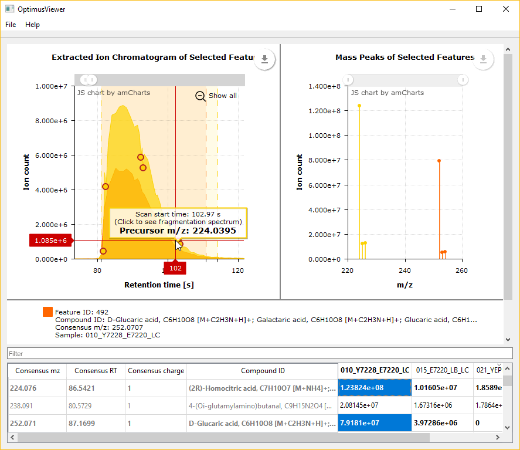

# OptimusViewer: application for visualizing LC-MS features detected with [Optimus workflow](https://github.com/MolecularCartography/Optimus).

## What it does?

OptimusViewer is designed to complement the visualization part of the [Optimus workflow](https://github.com/MolecularCartography/Optimus). OptimusViewer allows one to visualize plots of extracted ion chromatograms (XIC), MS peaks and MS2 spectra corresponding to features detected with Optimus. Moreover, all these plots can be overlaid for different features and/or different LC-MS runs to streamline any comparative analysis.

## Quick start guide

Go to the [Releases](https://github.com/MolecularCartography/OptimusViewer/releases) section of this repository and download a ZIP archive with the application according to your OS. Unzip the archive and launch `OptimusViewer` executable file.

*OS X users*: you might have a problem with running the application as it is not distributed via Mac App Store. Follow [this instruction by Apple](https://support.apple.com/kb/PH18657?locale=en_US) to make an exception for OptimusViewer.

Go to `File > Open` and select a "*.db" file produced by Optimus workflow. After the file is loaded, you will see an LC-MS feature quantification matrix where LC-MS runs correspond to columns, and features correspond to rows. The first 5 columns are special: they do not represent any run. Instead, there you can find the following properties of consensus features: numeric feature ID, m/z value, retention time, charge and metabolite annotations (if annotating was performed with Optimus). In the rest of the columns, intensities of features detected in corresponding samples are listed.
 
To sort the matrix content by any column, click on its header. Also, you can hide columns that you do not need. This option is available in the right-click menu called on a column header.
 
The matrix can be saved as a CSV file. To do it, go to `File > Export to CSV…`. Hidden columns will not be exported.
 
Click on any non-zero intensity value in the matrix. An XIC and mass peaks for the selected feature and run will show up on the plots in the upper part of the application window. A highlighted vertical stripe at the XIC chart denotes an elution period for the selected feature determined by Optimus. Hold Ctrl (Cmd on OS X) and click on other cells in the matrix to view overlaid plots for multiple features. Note that the legend under the plots is interactive: you can click on any legend item to show/hide a corresponding graph. Also, the graphs are resizable: drag the vertical separator between them or the top border of the matrix to change sizes of the plots.
 
On some XIC plots you can see large round marks. They denote MS/MS acquisition for a corresponding feature. If you click on such a mark, an MS/MS spectrum will be shown instead of the mass peak plot. Hold Ctrl (Cmd on OS X) and click on other marks to overlay multiple MS/MS spectra. The legend under the MS/MS plot also allows switching plots on/off. In order to return to the initial mass peak chart, click anywhere on the XIC plot.
 
You can export any plot as an image (multiple formats are available) using a pop-down menu at the top-right corner of the plot you need to save. Also, it is possible to save the plot data (i.e. the coordinates of points) as a CSV file. This option is available in the export menu as well.

## How to build?

1. You will need to install Qt 5.5 on your computer. Perhaps, earlier versions will also work, but it hasn't been tested.
3. Check out this repository with `git clone https://github.com/alexandrovteam/OptimusViewer`.
After OS-specific steps described below are completed, application binaries can be found in `./OptimusViewer/_release`.

### Windows

1. Install Microsoft Visual Studio.
2. Add paths to Qt binaries and `msbuild` tool to `Path` environment variable.
Example: `C:\Qt\Qt5.5.0\5.5\msvc2013\bin`, `C:\Program Files (x86)\MSBuild\12.0\Bin`.
3. Set working directory to `OptimusViewer` and execute `.\win_msvc_build_release.cmd`.

### OS X

1. Install XCode.
2. Add paths to Qt binaries to `PATH` environment variable:
  1. Execute `sudo nano /etc/paths`
  2. Add path to Qt binaries at the end of file.
  Example: `/Users/admin/Qt/5.5/clang_64/bin/`
3. Set working directory to `OptimusViewer` and execute `sh osx_clang_build_release.sh`

## License

The content of this project is licensed under the Apache 2.0 licence, see LICENSE.md.
